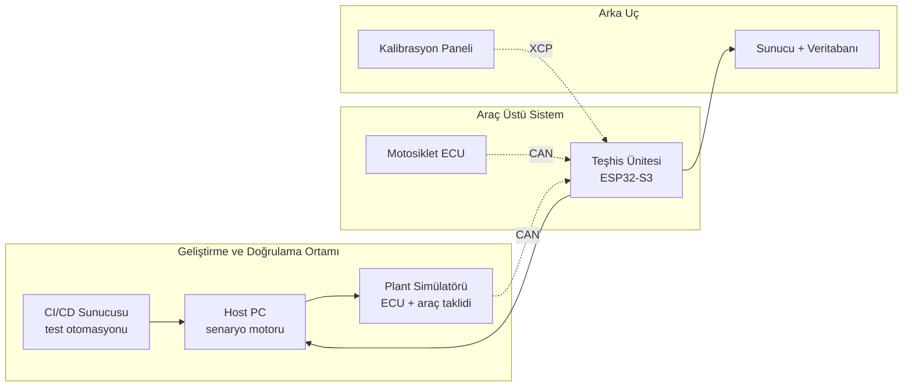

# Bitirme Projesi Kapsam Dokümanı

**Öğrenci:** Manisa Celal Bayar Üniversitesi, Bilgisayar Mühendisliği, 4. sınıf
**Tarih:** Eylül 2026
**Durum:** Danışman görüşmesi için taslak

---

## 1. Proje Başlığı

**Motosikletler için Otomotiv Standartlarına Uygun Gömülü Teşhis ve Sürücü Destek Ünitesi ile Donanım-Döngüde (HIL) Doğrulama Altyapısı**

Kısa hâli: *Otomotiv V-modeli süreciyle geliştirilen gömülü teşhis ünitesi ve test altyapısı*

---

## 2. Tek Cümlelik Tanım

Bir motosikletin CAN veri yolu üzerinden teşhis ve telemetri hizmeti veren gömülü bir ünite geliştirmek; bu üniteyi otomotiv sektörünün kullandığı protokol yığınlarıyla (ISO-TP, UDS) inşa etmek ve gerçek araca bağlanmadan test edilebilmesi için donanım-döngüde bir doğrulama tezgâhı kurmak.

---

## 3. Problem Tanımı ve Motivasyon

Otomotiv sektöründe geliştirilen gömülü yazılımların doğrulanması, aracın kendisi üzerinde yapıldığında maliyetli, tekrarlanamaz ve bazı senaryolar için imkânsızdır. Besleme gerilimi çökmesi, veri yolu hatası, sensör arızası gibi durumlar gerçek araçta güvenli biçimde üretilemez.

Bu proje iki problemi birlikte ele alır:

1. Motosikletler için araç verisine erişen, teşhis protokollerini destekleyen ve sürücüye bilgi/uyarı sunan bir gömülü ünite geliştirmek.
2. Bu ünitenin doğrulanması için düşük maliyetli, otomasyona uygun bir HIL test tezgâhı kurmak ve yazılım geliştirme sürecini sürekli entegrasyona bağlamak.

İkinci madde projenin özgün tarafıdır: HIL tezgâhları endüstride yaygın olmakla birlikte maliyetleri yüksektir; bu çalışmada mikrodenetleyici tabanlı, düşük maliyetli bir alternatif tasarlanmaktadır.

---

## 4. Sistem Mimarisi

Ünite, geliştirme sırasında plant simülatörüne, sahada ise gerçek ECU'ya bağlanır. İki bağlantı elektriksel olarak aynıdır; ünite aradaki farkı görmez. Doğrulamanın temeli budur.

---

## 5. Kapsam

Kapsam iki katmana ayrılmıştır. **Çekirdek** katman projenin taahhüdüdür ve tek başına bitirme projesi gereksinimlerini karşılar. **Genişletilmiş** katman, takvim izin verdiği ölçüde eklenecek modüllerdir.

### 5.1 Çekirdek Kapsam (taahhüt)

| # | Modül | İçerik | Tahmini saat |
|---|---|---|---|
| Ç1 | CAN sürücü katmanı | ESP32-S3 TWAI yapılandırması, hata durum makinesi yönetimi, bus-off kurtarma | 25-35 |
| Ç2 | ISO-TP taşıma katmanı | ISO 15765-2: segmentasyon, akış kontrolü, blok boyutu, ayrım süresi, zaman aşımı | 40-60 |
| Ç3 | UDS teşhis sunucusu | ISO 14229: 0x10 oturum, 0x27 güvenlik erişimi, 0x22/0x2E veri okuma-yazma, 0x19/0x14 arıza kodu, 0x31 rutin | 60-90 |
| Ç4 | HIL tezgâhı — donanım | Plant simülatörü MCU, CAN transceiver, sonlandırma, OBD2 konnektör, programlanabilir besleme | 40-60 |
| Ç5 | HIL tezgâhı — yazılım | Senaryo motoru, arıza enjeksiyonu, otomatik sonuç değerlendirme, test raporu | 50-70 |
| Ç6 | Test otomasyonu (CI/CD) | Self-hosted runner, commit başına derleme + statik analiz + donanımda regresyon | 30-40 |
| Ç7 | Veri toplama altyapısı | Sinyal kaydı, zaman damgalama, meta veri etiketleme, saklama şeması | 20-30 |
| Ç8 | Süreç dokümantasyonu | ISO 26262 yaklaşımıyla tehlike analizi (HARA), gereksinim–test izlenebilirlik matrisi, FMEA | 40-60 |
| | **Toplam** | | **305-445** |

### 5.2 Genişletilmiş Kapsam (takvim izin verirse)

| # | Modül | İçerik | Tahmini saat |
|---|---|---|---|
| G1 | UDS üzerinden bootloader | 0x34/0x36/0x37, A/B bank, CRC ve imza doğrulama, güç kesintisinde geri alma | 80-120 |
| G2 | XCP kalibrasyon arayüzü | ASAM XCP slave, A2L tanım dosyası, DAQ listesi, canlı parametre değişimi | 40-60 |
| G3 | Sürüş modu paneli | Şehir / tur / pist / ekonomi profilleri, eşik ve filtre parametrelerinin canlı ayarı | 30-50 |
| G4 | Sesli komut arayüzü | Bas-konuş, kapalı komut sözlüğü (20-30 komut), bağlam farkındalığı, sesli uyarı geri bildirimi | 60-90 |
| G5 | İstemci-sunucu ve veritabanı | Sürüş verisi senkronizasyonu, sinyal tanım şeması, sürüş sonu raporu | 80-130 |
| | **Toplam** | | **290-450** |

### 5.3 Kapsam Dışı (Faz 2 — mezuniyet sonrası)

Aşağıdaki modüller bilinçli olarak kapsam dışında bırakılmıştır. Gerekçeleri kaydedilmiştir:

- **Arıza tahmin / kestirimci bakım modeli.** Etiketli motosiklet arıza verisi literatürde mevcut değildir; mevcut veri setleri (CWRU, MaFaulDa) endüstriyel rulman tezgâhlarından geldiği için alan uyumsuzluğu vardır. Kontrollü arıza enjeksiyonuyla kendi verisinin toplanması gerekir ve bu tek başına 150-250 saatlik bir iştir. **Veri toplama Faz 1'de başlar (Ç7), model Faz 2'de kurulur.**
- **Raspberry Pi tabanlı işlem birimi.** Motosikletin elektrik bütçesi, titreşim ve ani güç kesintisi koşulları düşünüldüğünde gerekçelendirilemedi. ESP32-S3'ün yetmediği somut bir gereksinim ortaya çıkarsa yeniden değerlendirilecektir.
- **Serbest konuşma tanıma ve dil modeli tabanlı muhakeme.** Kırsal bölgede bağlantı garantisi olmadığı için sahada güvenilir çalışmaz.
- **ECU yazılımı değiştirme (stage haritalama).** Yasal, güvenlik ve garanti nedenleriyle kapsam dışıdır. Bunun yerine kalibrasyon etkileri HIL tezgâhında simülasyon ortamında incelenecektir.

---

## 6. Donanım Listesi (tahmini)

| Bileşen | Amaç | Tahmini maliyet |
|---|---|---|
| ESP32-S3 (2 adet: ünite + simülatör) | İşlem birimi | 600-900 TL |
| SN65HVD230 CAN transceiver (2 adet) | Fiziksel katman | 160-300 TL |
| IMU (ivme + jiroskop) | Hareket verisi | 150-300 TL |
| OBD2 dişi konnektör + kablo | Bağlantı | 150-250 TL |
| DAC kontrollü buck dönüştürücü | Programlanabilir besleme | 150-250 TL |
| Mikrofon modülü + buton (G4 için) | Sesli komut | 200-350 TL |
| PCB üretimi (2 tur) | Ünite kartı | 600-1000 TL |
| Muhafaza, konnektör, sarf | Montaj | 400-600 TL |
| **Toplam** | | **2400-3950 TL** |

---

## 7. Bilgisayar Mühendisliği Müfredatıyla İlişki

Projenin uygulama alanı otomotiv olmakla birlikte, teknik içeriği bütünüyle bilgisayar mühendisliği disiplinlerine dayanmaktadır.

| Proje bileşeni | İlgili alan |
|---|---|
| ISO-TP segmentasyon ve akış kontrolü | Bilgisayar ağları — taşıma katmanı tasarımı |
| UDS istek/yanıt, oturum yönetimi | Ağ protokolleri, istemci-sunucu mimarisi |
| CAN hata durum makinesi | Otomat teorisi, biçimsel modelleme |
| Bootloader, A/B bank, atomik güncelleme | İşletim sistemleri, bellek yönetimi |
| Gerçek zamanlı görev zamanlama | Gerçek zamanlı sistemler, RTOS |
| HIL senaryo motoru ve arıza enjeksiyonu | Yazılım testi, doğrulama ve geçerleme |
| Sürekli entegrasyon ve regresyon otomasyonu | Yazılım mühendisliği, DevOps |
| Sinyal tanım şeması ve sürüş verisi saklama | Veritabanı yönetim sistemleri |
| İstemci-sunucu senkronizasyonu | Dağıtık sistemler |
| HARA, izlenebilirlik matrisi | Gereksinim mühendisliği |

---

## 8. Doğrulama Yaklaşımı

Proje V-modeli süreciyle yürütülecektir:

- **Sol kol:** Gereksinim analizi → sistem mimarisi → modül tasarımı → gerçekleme
- **Sağ kol:** Birim testi → entegrasyon testi → sistem testi (HIL) → saha testi

Her gereksinim, kendisini doğrulayan test senaryosuyla eşleştirilecek ve izlenebilirlik matrisinde tutulacaktır. Bu matris tezin doğrulama bölümünün omurgasını oluşturur.

### Örnek test senaryoları

| ID | Uyarılan durum | Beklenen davranış |
|---|---|---|
| PWR-01 | Marş anında 12.6V → 9.0V, 300 ms | Sistem yeniden başlamaz, kayıt bütünlüğü korunur |
| PWR-02 | Kontak ani kesme | Denetimli kapanma, kalıcı bellek tutarlı |
| BUS-01 | ECU yanıt vermiyor (zaman aşımı) | Arıza moduna geçiş, kilitlenme yok |
| BUS-02 | Bozuk çerçeve / CRC hatası | Çerçeve reddedilir, hata sayacı artar |
| BUS-03 | Hata sayacı taşması → bus-off | Otomatik kurtarma gerçekleşir |
| BUS-04 | %80 veri yolu yükü | Mesaj kaybı yok, gecikme sınırlar içinde |
| UDS-01 | Geçersiz oturumda servis isteği | Doğru negatif yanıt kodu döner |
| UDS-02 | Hatalı güvenlik anahtarı, tekrarlı deneme | Gecikme sayacı devreye girer |
| SIG-01 | Devir sinyali tek çevrimde 0 → 9000 | Geçerlilik filtresi devrede |
| SIG-02 | Sinyal donması (10 sn sabit) | Bayat veri tespiti |
| END-01 | 8 saat kesintisiz çevrim | Bellek sızıntısı yok |

---

## 9. 14 Haftalık Takvim (çekirdek kapsam)

| Hafta | İş paketi |
|---|---|
| 1-2 | Gereksinim analizi, HARA, sistem mimarisi, test planı taslağı |
| 3-4 | CAN sürücü katmanı (Ç1), HIL tezgâhı donanımının kurulması (Ç4) |
| 5-6 | ISO-TP taşıma katmanı (Ç2) ve birim testleri |
| 7-9 | UDS teşhis sunucusu (Ç3) |
| 8-10 | HIL senaryo motoru ve arıza enjeksiyonu (Ç5) — Ç3 ile paralel |
| 10-11 | CI/CD kurulumu ve regresyon test setinin tamamlanması (Ç6) |
| 11-12 | Veri toplama altyapısı (Ç7), saha testleri |
| 12-13 | Genişletilmiş kapsamdan seçilen modül(ler) |
| 13-14 | Dokümantasyon (Ç8), izlenebilirlik matrisi, tez yazımı, sunum |

Veri toplama (Ç7) 4. haftadan itibaren arka planda sürekli işletilecek; her saha testi aynı zamanda veri toplama seansı olarak değerlendirilecektir.

---

## 10. Teslim Edilecekler

1. Çalışır durumda gömülü teşhis ünitesi (PCB ve muhafaza dahil)
2. HIL test tezgâhı (donanım + senaryo motoru)
3. Otomatik üretilen test raporu ve regresyon sonuçları
4. Kaynak kod deposu, sürüm geçmişi ve CI yapılandırması
5. Gereksinim–test izlenebilirlik matrisi
6. HARA ve FMEA dokümanları
7. Tez metni ve sunum
8. Saha testi videoları ve toplanan veri kümesi

---

## 11. Riskler ve Önlemler

| Risk | Etki | Önlem |
|---|---|---|
| Kapsam şişmesi | Yüksek | Çekirdek/genişletilmiş ayrımı; genişletilmiş modüller 12. haftadan önce başlatılmaz |
| PCB üretiminde tur kaybı | Orta | Prototip aşamasında delikli plaket; PCB siparişi 6. haftada verilir |
| CAN mesaj içeriklerinin çözülememesi | Orta | Standart OBD2 PID'leri taban alınır; ham mesaj tersine mühendisliği opsiyoneldir |
| Donanım arızası / bileşen temini | Orta | Kritik bileşenlerden yedek stok |
| Ders yükü ve staj başvurularıyla çakışma | Yüksek | Haftalık 20-25 saat hedefi; çekirdek kapsam bu bütçeye göre ölçeklenmiştir |

---

## 12. Danışman Görüşmesinde Konuşulacaklar

- Çekirdek/genişletilmiş kapsam ayrımı uygun bulunuyor mu?
- Değerlendirme ölçütleri açısından hangi bileşenlere ağırlık verilmeli?
- Bölümün laboratuvar imkânları (osiloskop, güç kaynağı, lehim istasyonu) kullanılabilir mi?
- Donanım maliyetinin karşılanması için bölüm/fakülte desteği veya proje bütçesi mümkün mü?
- Projenin bir bölümünün TÜBİTAK 2209-A veya benzeri bir programa başvurusu uygun olur mu?
- Tez formatı: doğrulama ve test bölümü ne kadar ağırlıkta olmalı?
